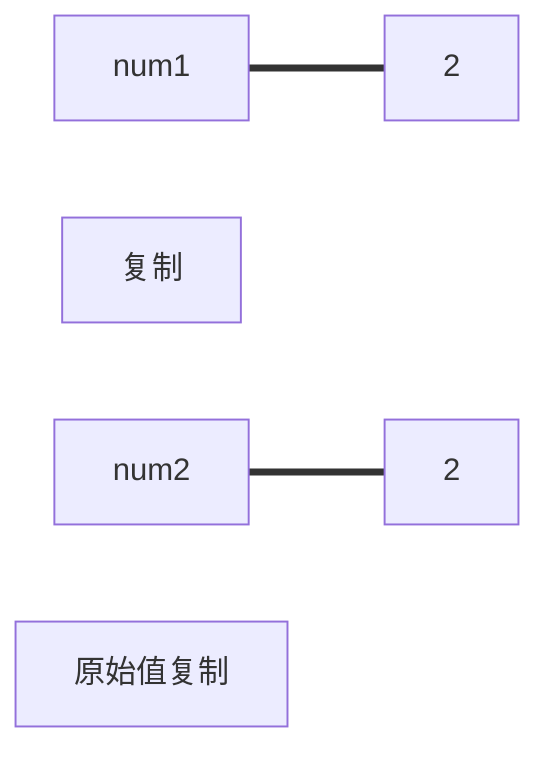
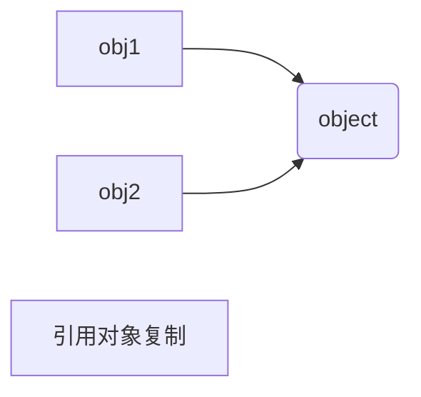

# 作用域
## 复制值
对于js而言复制值的情况有所不同（或者说大多数的语言都是如此）
### 对于原始值的复制
直接复制一份完全相同的出现



### 复制引用值（对象）
创建一个新的变量名，通过指针，指向复制对象所在的堆内存
因此，这要早就了不同的情况出现

## 传递参数
对于函数而言，传入的永远是一个值的复制
也就是说，对原始值，传入的是原始值的复制
而对于，引用值，传入的是引用值的一个复制
这也就造就了两种不同的情况出现了，这里我们简单讨论一下。
### 原始值的参数传入
这也就是非常容易理解的，函数内部的值，是完完全全的原始值的一个复制
所以，不会影响到外围的情况
```
let a = 2;
function addTen(num){
    num+=10
    return num
}
addTen（a）
// 还是a =2
```
上述的并没有对a进行修改，而是对a的一个复制进行了修改，当函数结束之后，num会被销毁
### 引用值传入参数
当引用值（对象）作为函数的参数传入时候，实际上传入的也是对象的一个复制
但是，由于在这个过程中，通过指针链接的，所以事实上在对函数内部对象进行修改的时候

实际上会通过指针进而传递到共同的堆内存，进行修改，在函数外面看到的情况就变成了对最开始对象的一个修改

但是本质上，函数的参数，一直都是一个局部变量（无论是原始值还是引入值）



